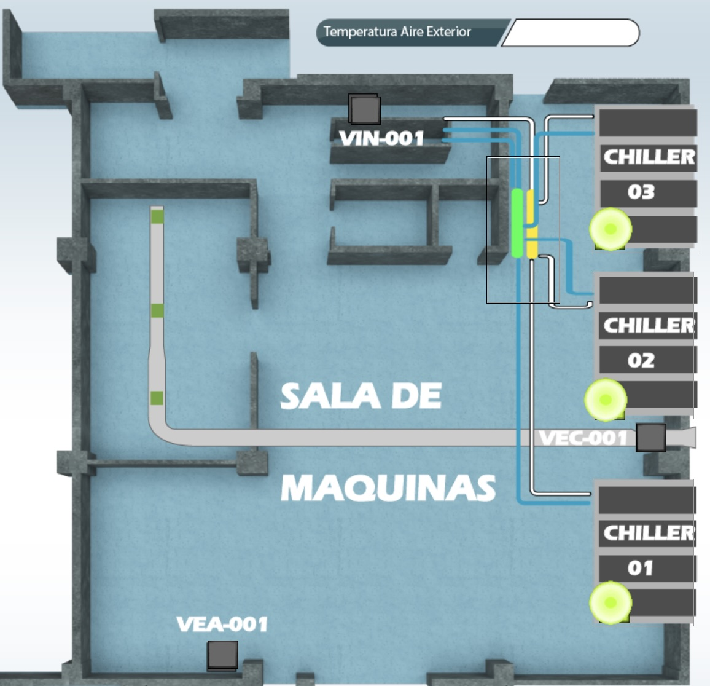
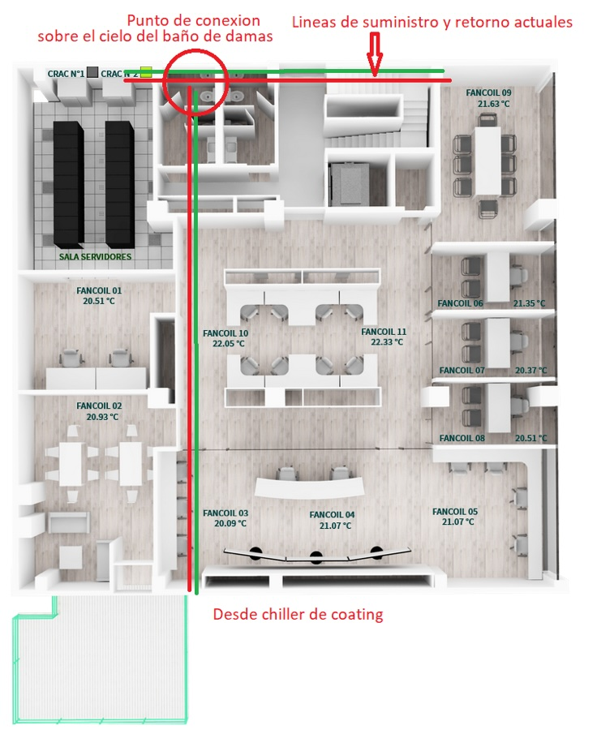
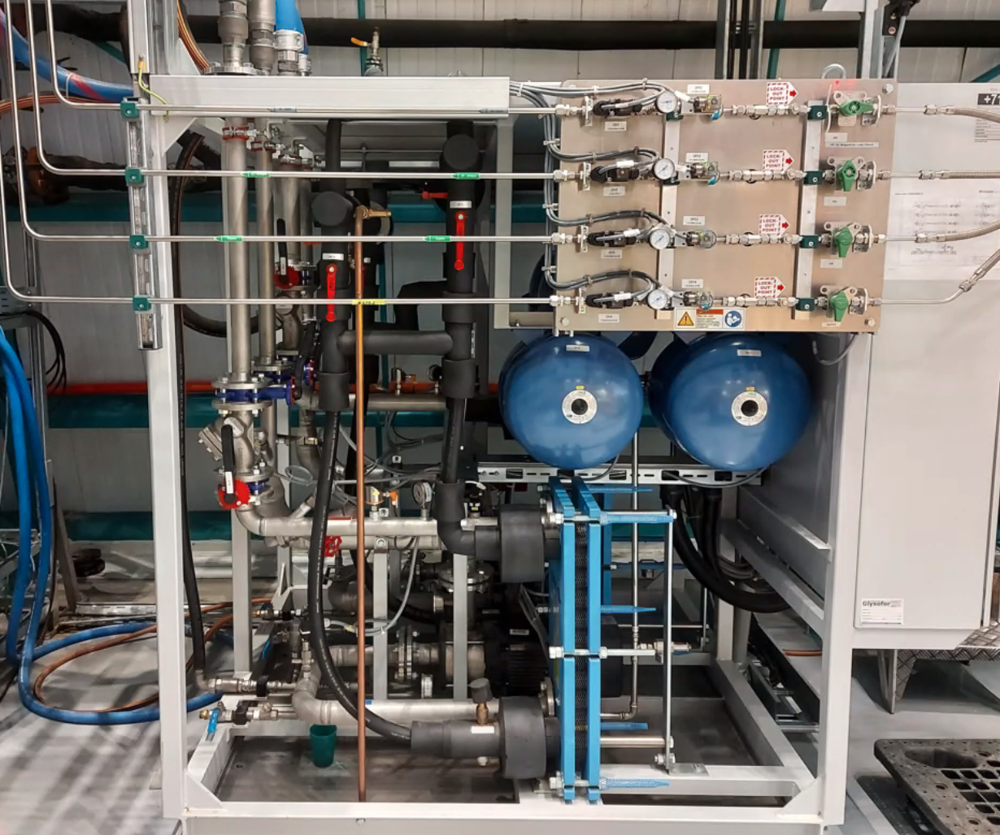
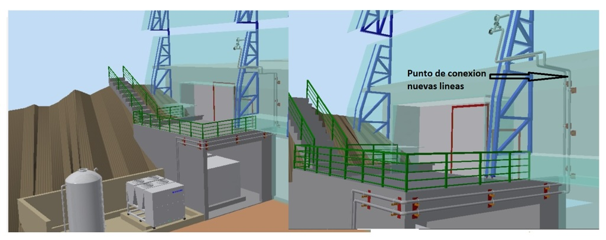

# Summit Computer Room Cooling System

```{abstract}
Describes cooling system of the computer room and plans for a backup line. 
```

## Introduction

The HVAC system is a critical component in maintaining optimal environmental conditions in the computer room.

The following is a summary of the current state of the cooling lines to the computer room, and plans for the installation of a new backup line.

## Current State

The cooling system for the computer room is connected to Chiller 3, located on the first floor of the building.



This Chiller supplies the CRAC units within the computer room. The lines connected to this Chiller are mixed with 35% glycol, which allows for optimal cooling efficiency and freeze protection. 
Glycol is essential in this setup as it prevents the coolant from freezing at low temperatures within the chiller. 

The lines supplying the CRAC units are installed within the false ceiling of the second floor, and the return lines interconnect above the location of the bathrooms.



There's a backup line connected to Chillers 1 and 2, which, through a heat exchanger, can supply the CRAC units in case of an issue with Chiller 3. 
A second backup, discussed below, would mitigate many risks to the computer room cooling.

## Planned State

To improve the availability of the CRAC units in the computer room, a second backup line from the Coating chiller will be connected to the main supply line that serves the computer room. This additional backup connection will enhance system redundancy, providing an extra layer of reliability in case of any disruptions with the primary or existing backup chillers

The Coating Chiller has one line toward the CHU with 38% glycol. Then, from the CHU (Cooling and Heating Unit), there are two isolated lines with 25% glycol each, one toward the Vacuum Pump System and the second toward the Magnetron System. The computer room CRAC will function equally well with a 38% or 35% glycol mix. 

Four electronically operated valves would be installed over the bathrooms to allow switching between the Level 1 and Level 3 chillers. 

There will be some mixing of the glycols in the computer room CRAC. 
This, or a accidental back flow, could lead over time to an equalization of the glycol at 36% (according to Doug). 
The 36% glycol mix  is estimated to make a 1% overall difference to cooling efficiency but could allow the computer room to be taken off the main chiller reducing load by about 30% if needed.

Since the coating chiller is the same chiller type as the other three, and it does not operate at a colder temperature it can not have a problem with the 35% glycol. The coating chamber chiller actually never operates at as cold of temperatures as the rest of the Chillers.

 
*Cooling and Heating Unit*

The reduction on glycol mix could potentially free up 50Kw of capacity from the main system which could be good in commissioning

The connection to the current line will be done as shown in the image.



### Considerations

Adding an inline filter near the coating chamber chiller, specifically on the line leading to the computer room, would be beneficial even though the coating chamber already has its own filter. 
Adding a new filter adjacent to the connections to the existing pipes prevents any contaminates in the pipes when they are installed from getting into the cooling system.

Installing a check valve can help prevent  waiting flow/cooling capacity by sending flow in the wrong direction, providing an additional layer of protection beyond the four motorized valves that will be installed in line with the coating chiller. 

### Controls

To ensure the correct functioning of the system, the following controls must be implemented:

- Monthly checks should be conducted, with the system running continuously for several days to ensure proper flow.

- Glycol concentration checks to maintain the expected mixture on both lines in the Coating chiller

- Regularly test the redundancy and switchover process of the backup systems to ensure they function seamlessly in an emergency.

<!--@include:acronyms.txt-->
